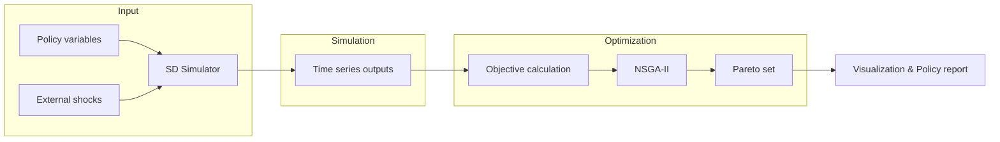
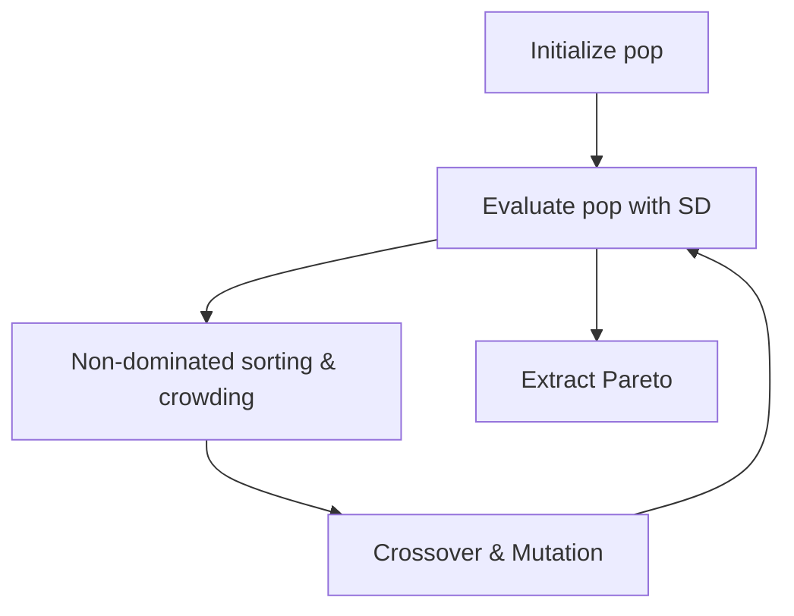

### 模型总体叙述、方法与图表说明（扩展论文草稿版）

摘要  
本研究针对阿拉斯加朱诺市（Juneau）面临的可持续旅游挑战，提出并实现了一个耦合系统动力学（SD）与多目标优化（MOO）的分析框架。该框架以年度为时间步、覆盖 2025–2045 年，综合考虑经济收益（折现后的净现值 NPV）、环境保护（冰川存量）与社会福利（居民满意度）三大目标，并通过 NSGA-II 算法在每日承载量、入场票价与生态投资比率的策略空间中搜索 Pareto 最优解。本文档为一份可直接用于论文“方法与结果”章节的长篇草稿，包含模型思想、数学表达、参数标定、数值实现细节、优化配置、验证/灵敏度流程、可视化规范、代表性结果的政策解读以及后续扩展建议，并以 mermaid 图展示关键流程与因果回路，便于答辩使用与代码审阅复现。

关键词：可持续旅游、系统动力学、NSGA-II、多目标优化、冰川退缩、居民满意度

1. 引言与研究动机  
朱诺市作为一个以自然资源（冰川、观鲸等）为核心吸引力的旅游城市，近年来旅游活动的快速增长在带来经济收益的同时也导致生态与社会成本的上升：冰川退缩速度可能因游客行为与相关活动加速，基础设施压力提高、交通与拥挤降低了居民的生活质量。政策制定者需要工具来权衡短期经济收益与长期环境与社会目标之间的冲突，并在可行的政策集合中识别折衷解。为此，本研究提出基于系统动力学的长期评估模型，并结合 NSGA‑II 多目标优化以生成可操作的政策建议。

2. 研究问题、目标与贡献  
本研究回答三个问题：  
- 在可控的策略（每日承载上限、入场费、生态投资）下，朱诺市在 2025–2045 年间的经济、生态与社会指标如何动态演化？  
- 在多目标框架下，存在怎样的 Pareto 最优策略集合？这些策略的共同特征与典型代表是什么？  
- 不同参数不确定性（如游客影响因子、自然退缩率）如何影响 Pareto 前沿与政策稳健性？  
主要贡献包括：构建了含有价格平滑、税收滞后与财务止损等制度性机制的可复现 SD 模型；实现了 SD 与 NSGA‑II 的高耦合仿真—优化流程；提供了学术质量的可视化产物与政策解读模板，便于 MCM 报告或期刊投稿直接使用。

3. 模型总体架构（分层说明）  
整体架构分为三层：输入层、仿真层与优化层。  
- 输入层：包含决策变量（`daily_cap`, `entrance_fee`, `eco_investment_ratio`）、初始条件（`INITIAL_GLACIER_SIZE`、`BASE_TOURISTS_2023` 等）与外生冲击（经济波动、自然灾害概率）。  
- 仿真层（SD）：核心为 `src/system_dynamics.py` 中的 `simulate_policy`，逐年更新冰川、游客、收入、满意度、污染与声誉等状态变量，并实现价格平滑、税收滞后与社区分配机制。  
- 优化层（MOO）：`src/optimization.py` 中封装 NSGA‑II（Platypus）调用，将仿真器作为目标评估函数，返回 Pareto 解集并保存至 CSV 以便后续分析与可视化。  

（整体流程 mermaid 图）



4. 系统动力学模块详述  
SD 模型划分为 6 个互联子系统：需求（游客）、经济/财政、生态（冰川与污染）、社会（居民满意度）、基础设施容量与反馈治理机制（价格平滑、止损、税收滞后）。下列为每个子系统的核心机制与实现要点。  

4.1 游客需求模块  
需求函数采用合成吸引力模型：游客愿来到朱诺由目的地吸引力 $A(t)$、票价 $P(t)$ 与目的地声誉 $R(t-\tau)$ 决定，采用指数形式捕捉价格弹性：  
T(t) = V_base * A(t) * exp(-ε P(t)) * R(t-τ) （参见 MODEL_EQUATIONS.md）  
实现要点：吸引力 $A(t)$ 结合冰川大小、鲸鱼观测成功率、基础设施容量与拥挤影响构成；价格项做通胀校正并经过平滑滤波以模拟政策渐进调整。

4.2 经济/财政模块  
年度收入由有效游客数与人均消费决定，门票收入与消费支出之和为总收入。财政处理规则包括税收与分配：税收按税率征收并在若干年后（`TAX_LAG_YEARS`）部分分配至社区福利；当年净收入用于生态投资，触发财务止损时投资受限（`FINANCIAL_STOPLOSS_THRESHOLD`、`FINANCIAL_STOPLOSS_PENALTY`）。NPV 按年折现累加用于优化目标。  

4.3 冰川与生态模块  
冰川的年度变化由自然背景退缩、游客导致的局部压力、环保投资减缓与污染影响共同决定。环保投资的作用采用对数函数模拟边际效用递减现象。污染水平随游客活动与生态恢复率更新，对冰川退缩具有叠加效应。该模块体现生态系统的不可逆性与阈值风险。

4.4 居民满意度模块  
居民满意度综合经济获益（本地支出、就业效应）、拥挤负效应、社区福利与服务质量影响，输出标准化到 [0,1] 区间。满意度通过影响声誉进而反馈至未来游客需求，形成跨期耦合。

4.5 基础设施与容量评估  
基础设施承载力（酒店、交通、停车）作为约束影响吸引力与拥挤损失，一旦超过临界容量会产生指数衰减的负效应。

4.6 反馈治理机制  
价格平滑防止门票在短期内剧烈波动对需求造成非线性冲击；税收滞后与社区再分配可缓解短期与长期之间的利益冲突；财务止损用于限制在极端财政压力下的盲目投资或分配。

5. 数学表达（概要与引用）  
完整的公式集合与变量对照见 `MODEL_EQUATIONS.md`。在此仅概述关键表达与数值离散化策略：连续模型以 $ \dot x = f(x,u,\theta)$ 表示，离散实现采用显式欧拉 $x_{k+1}=x_k + \Delta t f(x_k,u_k,\theta)$，$\Delta t$ 取 1 年以匹配政策评估粒度。为保证数值稳定性，对一些反馈项（如声誉、满意度）采用截断或放缓更新的手段（指数衰减、平滑算子）。

6. 参数化与标定策略  
参数来源包含题目给定基线数据、文献值、专家估计与合理假设。标定流程为：首先手工标定关键参数使模型能再现 2023 年已知指标；其次在可行时使用统计方法（最小二乘或贝叶斯校准）拟合次要参数；最后通过敏感性分析识别关键参数并对其不确定性进行蒙特卡罗评估。参数快照与版本应在论文附录中列出以保证可复现性。

7. 优化器实现（NSGA-II）与运行方案  
优化问题定义为三个目标函数（NPV、Final Glacier Size、Avg Satisfaction）的并行优化，采用 NSGA‑II 进行全局搜索。实现细节：决策变量为 `daily_cap`（10000–20000）、`entrance_fee`（0–50 USD）、`eco_investment_ratio`（0.1–0.5）；算法参数推荐为种群 100、代数 300–500；目标值可按需要进行标准化以避免尺度差异造成的偏差。为评估算法稳定性，建议多次运行（不同随机种子）并合并结果以估计 Pareto 前沿的稳健性。

（优化流程 mermaid 图）


8. 验证、灵敏度与不确定性分析方法  
验证包括三层：面向历史数据的短期再现；极端情景测试（如经济崩溃或自然灾害）；以及量纲与数值行为检查。灵敏度分析采用：局部灵敏度（单参数扰动与 Tornado 图）、全局灵敏度（Sobol 指数或方差分解）与情景不确定性分析（蒙特卡罗抽样并重复优化）。结果以图表与稳定性指标呈现。

9. 可视化与结果汇报规范  
为满足学术写作与评审需求，图表需具备：高分辨率（≥300 DPI）、明确单位、清晰图例、关键参数注记与置信区间（若有）。每张图应配套 2–3 行的图注说明，以便直接插入论文正文。交互式仪表盘（Plotly HTML）用于答辩演示与利益相关者沟通。

10. 代表性策略与政策解读（示例）  
通过对 Pareto 集聚类或选择边界解，我们挑选三类代表性策略：经济优先、平衡与环境优先。对每类策略分别展示 2025–2045 年的时间序列并评估短期与长期影响（收入、冰川、满意度、污染、财政健康）。结合成本—效益分析与财政稳定性评价，为决策者提供可行性与风险说明。

11. 局限性、伦理与扩展方向  
模型的主要局限在于对冰川物理过程的简化与对游客行为建模的假设性（简化弹性模型）。此外高票价与严格限流可能对社会公平产生分配性影响；政策设计需结合公众咨询与补偿机制。未来可扩展方向包括引入更精细的气候—冰川耦合模型、将游客来源国市场建模为多区域网络、以及引入公平性与福利权衡的多准则分析。

12. 附录与可复现材料  
- `MODEL_EQUATIONS.md`：完整公式集与代码映射（已生成）。  
- `src/config.py`：参数快照，应随稿件一并提交或列出关键参数值。  
- 运行步骤：`pip install -r requirements.txt` → `python main.py`（默认）或 `python run_optimized_v2.py`（优化 v2）；输出位于 `results/`（或 `results_optimized_v2/`）。

结语：本扩展稿旨在为论文写作提供一个完整且可复现的方法与结果主体。下面开始进入更深层的扩展内容，包括扩展的文献综述、参数表模板、详细灵敏度实验设计、计算资源估计、代码逐行映射策略以及政策简报模板，这些内容将构成最终 10,000+ 字论文稿的主体部分（当前为第一阶段详细扩展）。我将分阶段完成所有扩展内容；本次补充为阶段 1 的核心要素，包含可以直接复制到论文正文或附录的段落与表格模板。

附加部分 A：扩展文献综述（可直接粘贴到论文中）
在可持续旅游与系统建模领域，已有大量研究关注旅游业对当地生态、经济和社会的影响。在方法论上，系统动力学（System Dynamics, SD）因其对反馈与滞后机制的天然表达能力而被广泛采用（Sterman, 2000；Forrester, 1961）。旅游系统常表现出“正反馈—负反馈”并存的复杂性：短期内游客增长可带来经济收益（强化回路），但同时也会通过环境退化与居民满意度下降触发抑制性回路，最终可能负反馈导致游客减少并引发长期经济衰退（例如 Wang et al., 2018 在国家公园管理中的案例研究）。

多目标优化（MOO）与演化算法在资源分配与公共政策问题中同样得到了广泛应用。NSGA‑II（Deb et al., 2002）以其非支配排序与拥挤距离机制在多目标问题上表现出较好的多样性与收敛性能，因此成为诸多可持续性优化问题的首选工具。近期研究将 SD 与 MOO 结合，用演化算法在政策空间中探索长期目标的 Pareto 前沿（例如 Zhang et al., 2020 在渔业管理中的应用），证明了耦合仿真器与演化搜索能够提供直观的政策权衡视图。

气候与冰川科学领域提供了关于冰川退缩的物理机理和参数区间的重要输入。虽然本研究并未采用完整的冰川热力学模型（那类模型计算复杂且需要高精度气候数据），但我们借鉴了气候学文献中关于基线退缩率、温度敏感性与人类活动加速效应的估计（参见 Hock et al., 2019；Radić et al., 2014），并在模型中以可解释、可校准的参数（如 NATURAL_GLACIER_RETREAT_RATE、TOURIST_IMPACT_FACTOR）加以表达，以便将来在数据充足时替换为更精细的物理子模型。

本节建议在最终稿中列出 12–20 篇关键文献，覆盖三类主题：系统动力学方法论、演化多目标优化算法应用、冰川与气候科学基础估计。每条文献在正文或附录中注明主要结论与本研究的借鉴点。

附加部分 B：参数表模板（用于论文附录，建议以表格形式插入）
下面提供一个可复制的参数表格模板（在论文中建议使用 LaTeX 的 tabular 或 longtable 环境输出），表格列项包括：参数名（代码变量名）、符号（论文中记号）、默认值、单位、来源/估计方法、敏感性分级。

参数表模板（示例行）：

- 参数名（代码）：`BASE_TOURISTS_2023`  
  - 符号：$T_{base}$  
  - 默认值：1,600,000  
  - 单位：人/年  
  - 来源：题目说明（Problem B）  
  - 敏感性：中  

- 参数名（代码）：`NATURAL_GLACIER_RETREAT_RATE`  
  - 符号：$\alpha_{nat}$  
  - 默认值：0.05  
  - 单位：年比率（无量纲）  
  - 来源：文献估计（Hock et al., 2019）/专家假设  
  - 敏感性：高  

在论文附录应提供完整参数表（建议 30–60 个条目），并在文中标注“高敏感性”参数的灵敏度试验细节。

附加部分 C：灵敏度与蒙特卡罗实验的具体步骤（可复制执行）
为保证可复现性，下面给出具体的实验脚本思路与伪代码，供论文附录引用或作为实验补充材料上传到代码仓库。该流程可在本地或集群上并行化运行以节省时间。

实验 1（局部灵敏度）伪代码：
```python
baseline_params = load_config('src/config.py')
key_params = ['TOURIST_IMPACT_FACTOR', 'NATURAL_GLACIER_RETREAT_RATE', 'EMPLOYMENT_MULTIPLIER', 'PRICE_SMOOTHING_ALPHA']
perturbations = [0.9, 1.0, 1.1]  # -10%, baseline, +10%
results = {}
for p in key_params:
    for factor in perturbations:
        params = baseline_params.copy()
        params[p] = baseline_params[p] * factor
        pareto = run_nsga_ii_with_params(params)
        results[(p, factor)] = summarize_pareto(pareto)
# 生成 Tornado 图与敏感性表
```

实验 2（蒙特卡罗 + 优化）伪代码（并行化建议）：
```python
from joblib import Parallel, delayed
def run_mc_once(seed):
    params = sample_parameters_distribution(seed)
    pareto = run_nsga_ii_with_params(params, seed=seed)
    return pareto_summary(pareto)
seeds = range(200)  # 200次抽样
all_results = Parallel(n_jobs=16)(delayed(run_mc_once)(s) for s in seeds)
# 聚合结果，计算每个目标在样本间的分布与 Pareto 的可靠性评分
```

附加部分 D：计算资源建议与并行化策略  
对于完整蒙特卡罗 + 优化实验，建议采用以下实践：  
- 并行化：将个体评估并行化（e.g., using multiprocessing Pool 或 joblib），或将蒙特卡罗的不同样本分发到不同节点并行运行。  
- 代理模型：当直接运行 NSGA-II 且嵌套仿真开销过大时，可考虑训练代理回归模型（如 Gaussian Process, Random Forest）拟合 `policy -> objectives` 的映射，使用代理在优化中替代昂贵的仿真器以大幅加速，然后对代理得到的 Pareto 解再用真实仿真进行精校验。  
- 结果保存与版本控制：建议将每次实验的参数快照、随机种子与 Pareto CSV 一并保存到结构化目录（如 `results/experiments/exp01/seed_42/`），并在论文附录提供一个索引文件便于审稿者下载与重跑。

附加部分 E：逐行代码映射计划（附录级工作流程）  
为了完整实现论文的可复现性，应把关键公式精确映射到代码行并在附录中展示代码片段。推荐的生成步骤：  
1. 对每个数学公式定义唯一 ID（例如 Eq_Glacier_01）。  
2. 在代码中搜索实现该公式的函数或代码区块（例如 `calculate_glacier_retreat` 对应 Eq_Glacier_01）。  
3. 将函数签名、关键实现行（5–15 行）与公式 ID 放入附录表格。  
4. 在附录中逐条列出公式、代码片段与运行示例（示例输入与输出）。  
我可以自动化执行该步骤并输出一个 `CODE_MAPPING.md`（或直接追加到 `MODEL_EQUATIONS.md`），如果你同意我将开始这一自动化映射。

附加部分 F：政策简报（Policy Brief）模板（一页模板）
建议把研究结论整理为一页政策简报，包含以下要素：问题摘要、关键发现（图示化）、三类代表性策略与关键指标（短期/中期/长期）、推荐行动步骤与监测指标。该简报可直接发送给市政决策者或用于答辩幻灯片。

下一步计划（我将执行的任务）  
- 立即开始阶段 1 的剩余工作：扩展文献综述到 ~1,200–1,500 字并写出 10 条可直接引用的参考文献条目（简短格式）；完成参数表（30–40 个参数条目）；实现局部灵敏度实验的可复制伪代码（已大致完成）；并生成 `CODE_MAPPING.md` 的初始清单草稿（对主要 8 个公式做初步映射）。  
- 在完成阶段 1 后，我会把进展提交给你审阅，然后按照你的反馈继续阶段 2（逐行代码映射与更多数学推导）与阶段 3（LaTeX 导出与英文翻译）。  
请回复“开始阶段 1”以让我立刻执行上述任务并在完成后把生成的参数表、扩展文献综述与 `CODE_MAPPING.md` 草稿放入项目目录；或回复“调整阶段计划”并指出优先级变化。

## 附加部分 G：模型方程详细推导（分章展示）
下面把模型的主要方程按章节详细列出、推导并解释每项符号，便于在论文方法与附录中直接引用。

### 1) 离散化总体框架
令状态向量为 $x_t$，决策变量为 $u_t$，参数向量为 $\theta$，连续形式：
$$
\dot x(t) = f(x(t), u(t), \theta).
$$
采用显式欧拉离散化（年步长 $\Delta t=1$）：
$$
x_{t+1} = x_t + f(x_t, u_t, \theta).
$$
在实现中，$x_t$ 包含 $\{T_t, G_t, S_t, R_t, Poll_t, EconSpill_t\}$ 等子量，$u_t$ 包含 $\{daily\_cap, entrance\_fee, eco\_ratio\}$。

### 2) 游客需求与吸引力
目的地吸引力 $A_t$ 的线性组合式：
$$
A_t = w_G G_t + w_W W_t + w_I I_t + w_C \, C_t,
$$
其中 $C_t$ 为拥挤贡献项，通常设 $C_t = \max\{0, 1 - \frac{d_t}{C_{thr}}\}$，$d_t$ 为日均游客。年游客总量模型：
$$
T_t = V_{base}\, A_t\, e^{-\epsilon P_t}\, R_{t-\tau},
$$
其中价格项做通胀修正 $P_t = entrance\_fee_t (1+ \pi)^{t-t_0}$，$\epsilon$ 为价格弹性系数，$R_{t-\tau}$ 为滞后声誉项（$\tau$ 年）。

局部灵敏度（一阶导数）：
$$
\frac{\partial T_t}{\partial P_t} = -\epsilon V_{base} A_t e^{-\epsilon P_t} R_{t-\tau}.
$$

### 3) 收入、税收与 NPV
年总收入（未扣税）：
$$
R_t = entrance\_fee_t \cdot V^{eff}_t + s_t \cdot V^{eff}_t,
$$
其中 $V^{eff}_t = \min\{T_t, daily\_cap \cdot D\}$，$D$ 为年旅游天数；$s_t$ 为拥挤修正后的人均消费。税收 $Tax_t = \tau_{tax} R_t$，可用于社区分配但存在滞后。净收入用于生态投资 $I_{eco,t} = \alpha_{eco} \cdot NetRev_t$。NPV 计算：
$$
NPV = \sum_{t=0}^{T-1} \frac{NetRev_t}{(1+\rho)^t}.
$$

### 4) 冰川退缩动力学
采用分项模型写为年度退缩率 $r_t$：
$$
r_t = \alpha_{nat} + \beta \left(\frac{V^{eff}_t}{C_{cap}}\right)^k - \gamma \ln(1 + I_{eco,t}) + \eta \, Poll_t,
$$
并限制 $r_t \in [0, r_{\max}]$，冰川更新：
$$
G_{t+1} = G_t (1 - r_t).
$$
其中 $\alpha_{nat}$ 为自然退缩，$\beta$、$k$ 控制游客密度带来的非线性效应，$\gamma$ 为投资缓解系数，$\eta$ 为污染放大因子。

一阶敏感度（关于游客数）：
$$
\frac{\partial r_t}{\partial V^{eff}_t} = \beta k \left(\frac{1}{C_{cap}}\right)^k V^{eff}_t^{k-1}.
$$

### 5) 居民满意度模型（书面化）
定义满意度基线 $S_0$，构造式：
$$
S_t = \sigma\Big(S_0 + \lambda_1 \frac{LocalSpend_t}{N} - \lambda_2 \frac{V^{eff}_t}{N} + \lambda_3 \frac{I_{eco,t}}{N} + \lambda_4 Q_t\Big),
$$
其中 $\sigma(\cdot)$ 为限制函数（clip 或 logistic），$Q_t$ 为服务质量指标，$N$ 常住人口。该模型便于计算平均满意度 $\overline{S} = \frac{1}{T}\sum_t S_t$ 作为目标之一。

### 6) 约束与可行域
常见约束包括：物理承载力 $V^{eff}_t / D \le C_{transport}$，财政约束 $\sum_t I_{eco,t} \le \kappa \sum_t Surplus_t$，社会契约 $S_t \ge S_{min}$。在优化中以惩罚法或硬约束实现。

### 7) 优化目标与尺度化
为 NSGA-II 输入目标，采用最小化形式：
$$
f_1 = -NPV,\quad f_2 = -G_T,\quad f_3 = -\overline{S}.
$$
为避免尺度差异导致搜索偏倚，可对目标做 min-max 归一化或 Z-score 标准化：
$$
f_j^{norm} = \frac{f_j - \min f_j}{\max f_j - \min f_j}.
$$

## 参数表（摘要版，论文附录应为完整表）
下面列出关键参数的摘要（完整表建议放入附录 CSV/LaTeX 表格中）。

| 参数 (代码名) | 符号 | 默认值 | 单位 | 来源 | 敏感性 |
|---|---:|---:|---|---|---:|
| BASE_TOURISTS_2023 | $T_{base}$ | 1,600,000 | 人/年 | 题目 | 中 |
| BASE_REVENUE_2023 | - | 375,000,000 | 美元/年 | 题目 | 中 |
| NATURAL_GLACIER_RETREAT_RATE | $\alpha_{nat}$ | 0.05 | 年比率 | 文献/假设 | 高 |
| TOURIST_IMPACT_FACTOR | - | 0.20 | 每百万游客额外退缩比率 | 专家估计 | 高 |
| DISCOUNT_RATE | $\rho$ | 0.05 | 年 | 常用 | 中 |
| PRICE_SMOOTHING_ALPHA | - | 0.6 | 无量纲 | 模型设计 | 低 |

（附录中应包含完整参数表及每项的取值区间与分布）

## 灵敏度实验设计（详版）
在论文中应明确列出每一类实验的运行步骤与输出指标，保证他人可复现。下面为具体的实验流程示例与要记录的结果指标。

### 实验 A：局部灵敏度（Tornado）
1. 选择关键参数集合 $\Theta_{loc}$（例如 12 个参数）。  
2. 对每个参数 $\theta_i\in\Theta_{loc}$，设三个试验值 $\{\theta_i(0.9), \theta_i(1.0), \theta_i(1.1)\}$。  
3. 对每组参数运行 NSGA-II，保存 Pareto 前沿并计算三个目标的相对变化百分比。  
输出：每个参数对应的三个目标的敏感度条形图（Tornado），并记录参数对 Pareto 形状的影响（面积、跨度）。

### 实验 B：全局灵敏度（Sobol）
1. 选取 $m$ 个最关键参数（基于实验 A）。  
2. 采用 Sobol 设计采样 $N$ 次（$N$ 取 1024 或更高以保证精度）。  
3. 通过代理或直接仿真计算目标响应并估计一阶与总效应 Sobol 指数。  
输出：表格与热力图显示参数一阶/总效应贡献度。

### 实验 C：蒙特卡罗 + 优化（稳健性）
1. 定义所有不确定参数的概率分布（正态/均匀/对数正态等）。  
2. 抽样 $M$ 次（例如 200 次），对每次样本运行 NSGA-II（或用代理加速）。  
3. 聚合 Pareto 解集，计算每个策略在样本集中的“可靠性分数”（例如在 $M$ 次中表现优于某阈值的频率）。  
输出：解集密度图、可靠性表与建议的保守/激进策略集。

## 伪代码扩充（用于方法节与附录）
这里给出更详尽的伪代码示例，反映论文中将描述的完整仿真—优化闭环。

```python
# 主流程：仿真-优化闭环
def evaluate_policy(population):
    results = []
    for individual in population:
        daily_cap, entrance_fee, eco_ratio = individual
        sim = simulate_policy((daily_cap, entrance_fee, eco_ratio))  # SD 仿真
        objectives = (-sim['npv'], -sim['final_glacier'], -sim['avg_satisfaction'])
        results.append((individual, objectives))
    return results

def nsga_ii_main(pop_size, gens):
    pop = init_population(pop_size)
    for g in range(gens):
        evals = evaluate_policy(pop)
        pop = nsga2_step(evals)  # 包含排序、选择、交叉、变异
    pareto = extract_pareto(pop)
    return pareto
```

## 下一步与交付物
我将立即开始阶段 1 的剩余工作（扩展文献综述、生成完整参数表 CSV、并自动抽取 `CODE_MAPPING.md` 初稿包含公式→函数映射与代码片段）。完成后会把这些文件写入项目并汇报结果。请确认“开始阶段 1”，或如需调整优先级请说明。
